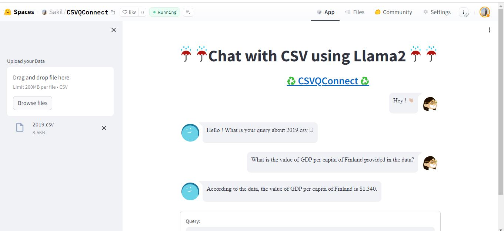

### CSVQConnect Introduction

In the age of data-driven decision-making, extracting insights from vast troves of information has become increasingly crucial. However, navigating through complex datasets can be a daunting task, often requiring specialized skills and tools. CSVQConnect, application powered by Llama2, LangChain, and vectordb Faiss DB, aims to bridge this gap by enabling seamless conversational interactions with CSV data.

With CSVQConnect, users can upload their CSV files and engage in natural language queries to retrieve specific information or uncover hidden patterns. The application's intelligent language processing capabilities transform raw data into meaningful insights, empowering users to make informed decisions without the need for technical expertise.
